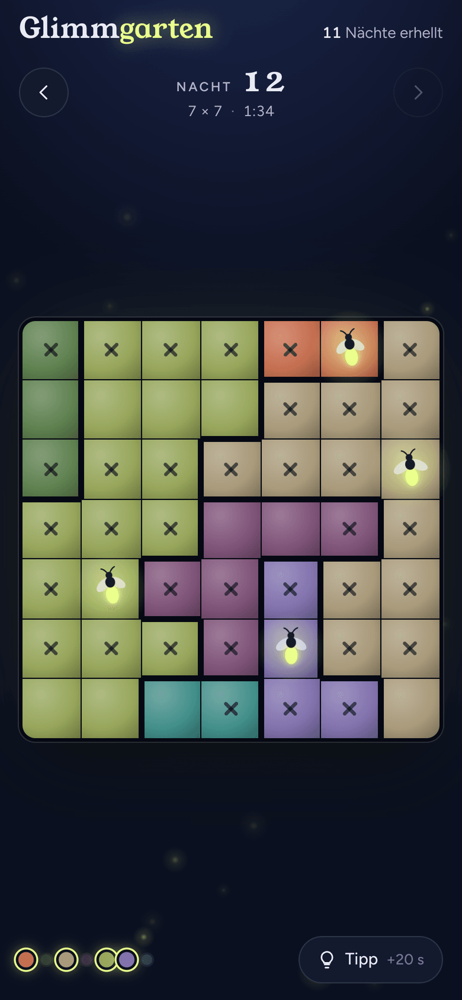
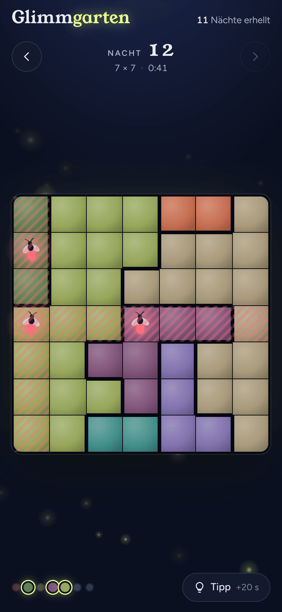
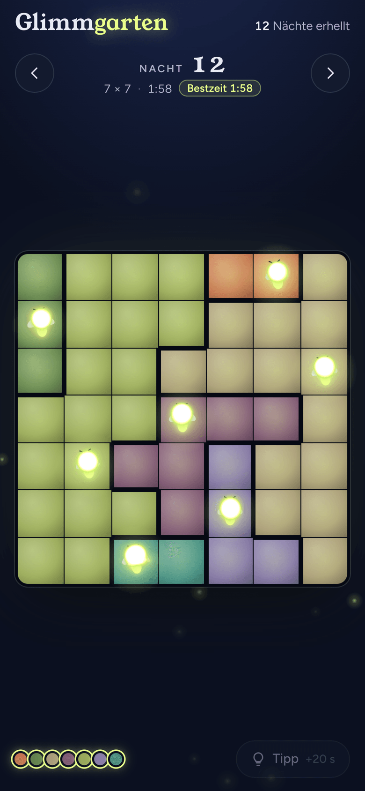
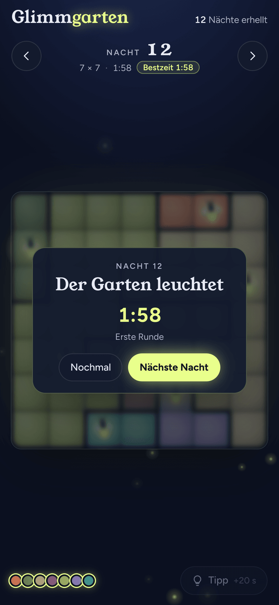

# Glimmgarten

Ein Logikrätsel nach dem Vorbild von *Queens*, in einem nächtlichen Garten. Setze in jedes Beet genau ein Glühwürmchen, bis der ganze Garten leuchtet. Die Nächte werden endlos neu erzeugt, und jede hat genau eine Lösung.

**Spielen:** [eweren.github.io/glimmgarten](https://eweren.github.io/glimmgarten/)

  
  
  
  

## Regeln

- Jedes farbige Beet bekommt genau ein Glühwürmchen.
- In jeder Zeile und jeder Spalte leuchtet genau eins.
- Glühwürmchen berühren sich nie, auch nicht über Eck.

Einmal tippen setzt eine Markierung, zweimal ein Glühwürmchen, ein drittes Mal leert das Feld. Wischen markiert mehrere Felder auf einmal. „Tipp“ setzt ein richtiges Glühwürmchen oder entfernt ein falsches und kostet 20 Sekunden.

## Nächte

| Nächte | Brett |
| --- | --- |
| 1–3 | 5 × 5 |
| 4–10 | 6 × 6 |
| 11–25 | 7 × 7 |
| 26–50 | 8 × 8 |
| 51–100 | 9 × 9 |
| ab 101 | 8 × 8 bis 10 × 10 |

Jede Nacht entsteht deterministisch aus ihrer Nummer: Nacht 42 sieht auf jedem Gerät gleich aus. Der Generator legt eine gültige Anordnung fest, lässt die Beete darum wachsen und verschiebt so lange einzelne Felder zwischen Beeten, bis der Solver nur noch diese eine Lösung findet.

## Technik

Statische PWA ohne Build-Schritt und ohne Abhängigkeiten.

- `index.html`: Spiel, Generator und Solver in einer Datei
- `sw.js`: Service Worker, cacht alles für den Offline-Betrieb
- `manifest.webmanifest`, `icons/`, `fonts/`: Installation und lokale Schriften (Young Serif, Figtree)

Fortschritt, Bestzeiten und angefangene Bretter liegen im `localStorage` des Geräts.

**Nach Änderungen** `VERSION` in `sw.js` hochzählen, sonst behalten installierte Apps die alten Dateien.

Installieren: in Safari *Teilen → Zum Home-Bildschirm*, in Chrome *Menü → App installieren*.
